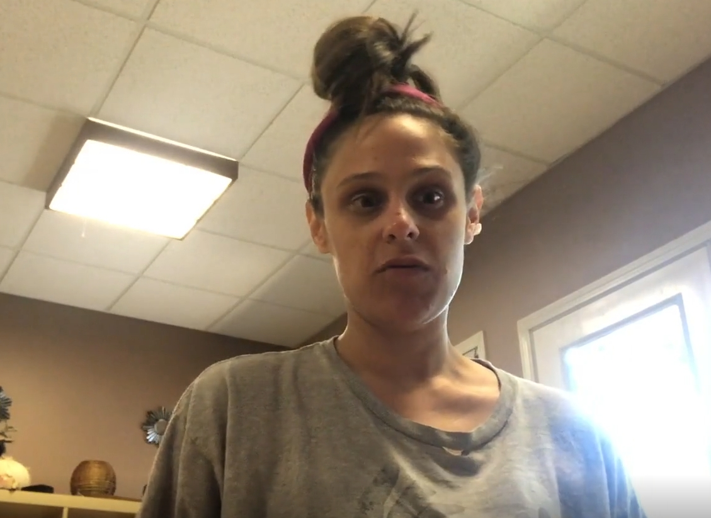
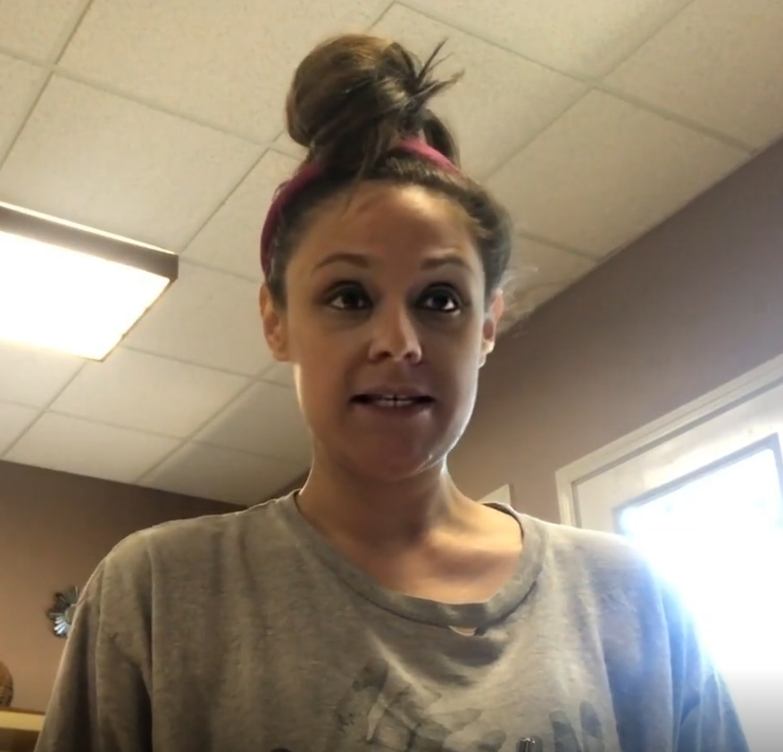
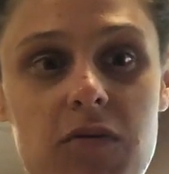

# mge51101-20196018

```
Name: YoungJun Choo  
Student No.: 20196018  
School: Business Analytics  
E-mail: gkdlfnddy@unist.ac.kr  

```


• upload your plan on GitHub (use markdown)
my plan is predict deepfake about voice and face so i will use kaggle data

교수님 한테 이미 보여 드렸는데 그때 받은 코맨트 대로 수정 하고 있는 중입니다. 

목표는 이번 학기동안 공부해서 학습이 되고 페이크를 예측 하는 것 입니다. 

데이터를 받고 하는데 시간이 많이 걸리는데 이미 그런 과정은 완료를 해서 분석을 어떻게 해야 할지에 대해서만 

고려하면 될 것 같습니다. 

참고 하실만한 자료를 공유 해 주시면 감하겠습니다. 
 

kaggle deepfake data 분석 

Voice & Video data

• What is your goal? Why this is important problem?

purpose nowadays fake videos are damaging many people 

becase of Technology (Deeplearning, GAN ....)

That technology makes fake videos so sophisticated that it is difficult for humans to distinguish them.

• Explain your Data Science problems in detail

1. Video data is consist of 2 part color(R,G,B) and Time that is why it need high dimensional analysis
2. 3D conv Tech is not verified and hard to filter analysis point
3. Fake is consist of Two part (Video or Voice) but we don't know what fake is applied
4. Voice Detection need anothor Tech (actually i don't know so i need to study.)
5. computing resource is not enough 

Detain image is below 




more detail about image 
what is part of fake? eye.. 

below image show more detail about fake




So we neet to detect this kind of fake 
Actually it is not difficult part because we can detect by our eyes.
Detection algorithm can detect fake batter than human, so it is very hard technique

And Voice fake is also exist actually i dont know exactly how to detect voice i will learn and develop by your class and self study during this semaster

• How to evaluate your model empirically? What is your metric?

In this case It  just distinguish Fake or Not so I use BinaryCrossentropy it is suitable for this case because it can detect more sensitively especially between 1 and 0


So evaluation standard is mean of BinaryCrossentropy 

default value is 0.69 

• Describe [ what is, how to gather, difficulty of ] your data concretely

Video data 500GB is on [kaggle](https://www.kaggle.com/c/deepfake-detection-challenge/data, "kaggle link") website for gathering it is down through the Internet, also data each data make Time Serial Image data and Voice data for Learning 

it take almost 1 month...

• Feasibility

now what i do 

first, extract 10 Face by using MTCNN from each video 

second, resizing 255,255,3 

third, extract 1 voice data by using moviepy editor

fourth, make a network. I try many times now using multi input and 2dconv instead of 3dconv and ensamble of each result

fifth, leaning start using Adam optimizer and BinaryCrossentropy loss fuction

sixth, now fail... so try again with your comment i think 

My purpose is to have a better score than kaggle first place 0.19170. I would like to do so and issue paper.
