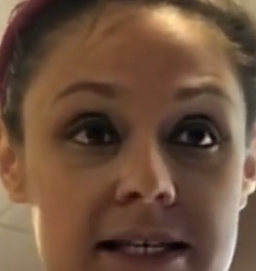

# mge51101-20196018

```
Name: YoungJun Choo  
Student No.: 20196018  
School: Business Analytics  
E-mail: gkdlfnddy@unist.ac.kr  

```

kaggle deepfake data 분석 

Voice & Video data

• What is your goal? Why this is important problem?

first goal nowadays fake videos are damaging many people 

becase of Technology (Deeplearning, GAN ....)

second goal is to have a better score than kaggle first place 0.19170. I would like to do so and issue paper.

third goal is to understand state of the art tech (attention , emsemble..) and using my algorithm

• Description of data

Video data almost 500GB is on [kaggle](https://www.kaggle.com/c/deepfake-detection-challenge/data, "kaggle link") website 

Almost 200000 training videos are provided on website

each video has explaination about it is fake or not.. and if it is fake, additional information origin video is added
ex)
"owxbbpjpch.mp4": {"label": "FAKE", "split": "train", "original": "wynotylpnm.mp4"}, 
"vpmyeepbep.mp4": {"label": "REAL", "split": "train"},

but it isnt explain about kind of fake (voice? video?)

many kind of people is provided (black, white, brown, man,woman, older people, younger..)

some video show more than two people..


• Explain your Data Science problems in detail

1. Video data is consist of 2 part color(R,G,B) and Time that is why it need high dimensional analysis
2. 3D conv Tech is not verified and hard to filter analysis point
3. Fake is consist of Two part (Video or Voice) but we don't know what fake is applied
4. Voice Detection need anothor Tech (actually i don't know so i need to study.)
5. computing resource is not enough 

Detail image is below 


more detail about image 
what is part of fake? eye.. 

below image show more detail about fake




So we neet to detect this kind of fake 
Actually it is not difficult part because we can detect by our eyes.

Some videos are impossible to detect fake by my eyes. In general, two algorithm is proposed first is 2d conv and 3d conv. but 2 alogorithm have a problem. 2d conv algorithm cant consider timestream, 3d conv algorithm need high computing power and is still developed so it isnt have standard structure. Therefore, It is hard mission until now.


• How to evaluate your model empirically? What is your metric?

Evaluation Matrix is F1 score 

Threshold about fake dection is 0.5 but it can be changed by result


•  Data preparation and plan

first- extract 10 Face by using MTCNN from each video and consider exception case (ex) 2face detection and face not found by MTCNN

(whole image)


(face image by MTCNN)


second- resizing 255x255x3 or 150x150x3(each case will be chosed by algorithm size and result)

third- extract 1 voice data by using moviepy editor

fourth- make a network. (2d conv alogrithm, 3d conv algorithm)

fifth- leaning start using Adam optimizer and BinaryCrossentropy loss fuction


sixth- evaluate model and compare with kaggle algorithm 


