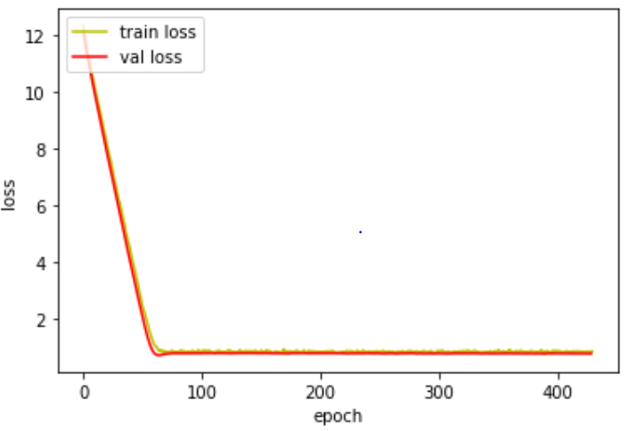

# mge51101-20196018

```
Name: YoungJun Choo  
Student No.: 20196018  
School: Business Analytics  
E-mail: gkdlfnddy@unist.ac.kr  

```

kaggle deepfake data 분석

# Introduction
Nowadays, youtube generates many videos. someone makes fake videos and voices for their benefits. and it makes many problems in society. they make even president fake videos. Therefore, it is a very important technology. we research fake video detecting algorithm.

Recently, Deep Neural Networks is a paradigm. It solves many difficult problems such as NLP[1], S2S[2], Image Detection[3][4], Voice Recognition, MOT[5], GAN[6]. In this paper, We use Two technology Image detection and Voice Recognition. Because it can relate to video analysis.

Many researchers publish noticeable papers about CNN. For example, MTCNN[7] can detect faces, Batch normalization[8] can allow using a high learning rate, Inception block can extract complicate feature. To apply the CNN algorithm for deepfake detection, we need to answer the following questions:

- Can we extract face from video without error?
- Can we get voice information from the video?
- Can we detect fake or not by using face and voice information?

Solving the above questions makes improvements about fake detection algorithm. In this paper, we don't have remarkable achievements. Because this paper is an intermediate process of algorithm development. Therefore, we focus on applying algorithms and experiment algorithms. The brief contributions can be summarized as follows:

- To extract the face image, we use the MTCNN algorithm and we consider error situations. so we can extract face from video without error.
- To extract voice information, we use moviepy package. It allows to extract voice information from the video.
- To detect fake or not, we use the CNN algorithm, inception block, Batch normalization, Sigmoid activation function for the last activation function.

Finally, we have a discussion about our experiment and future works.

# Related work

The literature on image detection and CNN algorithm is vast and span. So, we focus on recent research about Convolution Neural Networks. To detect the face,  some of the CNNs based face detection approaches have been proposed in recent years. Yang et al. [13] train deep convolution neural networks for facial attribute recognition to obtain a high response in face regions which further yield candidate windows of faces. However, due to its complex CNN structure, this approach is time costly in practice. Li et al. [14] use cascaded CNNs for face detection, but it requires bounding box calibration from face detection with the extra computational expense and ignores the inherent correlation between facial landmarks localization and bounding box regression. To overcome the previous problem MTCNN[7] is suggested and it shows high performance we use this algorithm for face detection.

To detect fake, feature extraction algorithm is also important. Many researchers know it is important and publish many papers. Residual bock[4] is proposed to alleviate gradient descent with low parameters. For the same reason, the Densely block[3] is designed and it has an additional advantage about preservation images minor characteristics. Google develops inception block[9]. this algorithm's advantages are dimension reduction and extraction of non-linear features. We apply this inception block. 

# Method

 In this section, we will have a comprehensive explanation of MTCNN, Face extraction algorithm, one image analysis algorithm, Voice analysis algorithm, last analysis algorithm and overall structure.

In the MTCNN Section, we refer to MTCNN and just apply it to our model for extracting face. This method consists of P-Net(Proposed Network), R-Net(Refinement Network), O-Net(Output Network). Each Network has its own functions. P-Net proposes candidates of windows about face classification by using input(12x12x3), bounding box regression, facial landmark location. The highly overlapped information is merged by NMS. After this information becomes R-Net input data(24x24x3). It is working similarly to P-Net, but R-Net analysis more detailly. R-Net’output data becomes O-Net’input data(48x48x3). O-Net analyzes a similar way and makes a more detailed output. This initial input image has a pyramid structure(200X160X3, 100X66X3, 30X20X3).


(Figure 1 MTCNN 3 key methods with pyramid input)

In the Face extraction algorithm Section, we make this algorithm to extract face image from video. MTCNN can extract face 95%, so we need to consider the error situations. In figure 2, this algorithm considers the error so we can get input data. We use CV2 video capture functions for capturing images. MTCNN detects Face from the captured image. If we detect 10 images, these become input data(10,256,256,3).


(Figure 2 Face extraction algorithm)

In the One Image fake detection Algorithm, to analyze face data for detecting fake or not like figure 3. We apply inception, Batch normalization, Maxpooling. Before connecting to the FC layer. Lastly, we reduce nodes to concatenate 10 images data and voice data.


(Figure 3 one image analysis algorithm)

In the Voice fake detection Algorithm, to analyze voice information, we apply mainly the 1D convolution layer like Figure 4. 


(Figure 4 Voice fake detection Algorithm)

In theLast CNN Algorithm, the Last CNN algorithm's main function is that we concatenate 11 outputs from image and voice. To calculate loss value, we make the last value 0(Real) or 1(Fake).


(Figure 5 Last CNN Algorithm)

Now, we can understand how each algorithm work to detect video fake. We are coding like figure 6. This jupyter code is downloaded from https://github.com/Chooyoungjun/mge51101-20196018/tree/master/deepfakedetection/code.


(Figure 6 Overall structure)

# Result
In the result section, we will explain about Loss function and Test Result. 
### Loss function
We use the Binary Crossentropy loss as a criterion. It is computed as:


This loss function can calculate large value when the prediction is wrong. For example, the ground truth is 0 and the prediction value is 0.9. The loss is 1. If the prediction value is 0.99, the loss is 2. If the prediction value is 0.1, the loss is 0.0457. Likewise, this loss function can calculate the exact loss value for training. That is why we choose this loss function.
### Test Result
In this project, the loss function is criterion and metrics. This information can check the [Kaggle evaluation]( https://www.kaggle.com/c/deepfake-detection-challenge/overview/evaluation, "kaggle link"). 
In my cases, the loss value is 0.6974. it isn’t a good performance. We will discuss results and future works in the conclusion section.
|epoch|learning rate|
|------|---|
|400|0.00001|

Train loss & validation loss



# Conclusion

Our final result 0.6974 is lower than 0.19207. Because our results are too low, we analyze the cause. We find two reasons. The first reason is that we use Batch Normalization. The second reason is that we need to apply a reasonable algorithm to detect fake videos. Batch Normalization properly works in enough batch size, but we use too big size image and deep algorithm to use large batch size. We just apply the inception block. It isn’t enough to detect fake videos.
Our future research is that we will apply proper normalization and more advanced algorithms. Batch Normalization is replaced by Group Normalization[10]. Group Normalization doesn’t relate to Batch size. We can predict that Group normalization allows us to use a large learning rate and alleviate gradient vanishing. We will try to apply attention[11], residual mechanism, gating mechanism[12], densely block, and lastly my research algorithm. We refer BAM to apply attention. Attention can highlight important positions to detect fake. 2D convolution gating block function is the same as Attention. My algorithm is writing now in this year. I will publish this algorithm. My algorithm is for 1D convolution. So I have the plan to make my algorithm to 2D convolution. After all tests, we will ensemble all algorithms.

Below Example snapshot is my papers part of time series attention function like this example I will apply algorithm to detect fake.


# Reference
[1]	W. Yin, K. Kann, M. Yu, and H. Schütze, “Comparative Study of CNN and RNN for Natural Language Processing,” Feb. 2017, Accessed: May 25, 2020. [Online]. Available: http://arxiv.org/abs/1702.01923.

[2]	I. Sutskever Google, O. Vinyals Google, and Q. V Le Google, “Sequence to Sequence Learning with Neural Networks.” Accessed: May 25, 2020. [Online]. Available: http://papers.nips.cc/paper/5346-sequence-to-sequence-learning-with-neural-.

[3]	G. Huang, Z. Liu, L. Van Der Maaten, and K. Q. Weinberger, “Densely Connected Convolutional Networks,” 2017. Accessed: Apr. 01, 2020. [Online]. Available: https://github.com/liuzhuang13/DenseNet.

[4]	K. He, X. Zhang, S. Ren, and J. Sun, “Deep Residual Learning for Image Recognition,” 2016. Accessed: Apr. 01, 2020. [Online]. Available: http://image-net.org/challenges/LSVRC/2015/.

[5]	Y. Xu, A. Osep, Y. Ban, R. Horaud, L. Leal-Taixe, and X. Alameda-Pineda, “How To Train Your Deep Multi-Object Tracker,” Jun. 2019, Accessed: Jun. 07, 2020. [Online]. Available: http://arxiv.org/abs/1906.06618.

[6]	C. Ledig et al., “Photo-Realistic Single Image Super-Resolution Using a Generative Adversarial Network,” 2017.

[7]	K. Zhang, Z. Zhang, Z. Li, and Y. Qiao, “Joint Face Detection and Alignment using Multi-task Cascaded Convolutional Networks,” IEEE Signal Process. Lett., vol. 23, no. 10, pp. 1499–1503, Apr. 2016, doi: 10.1109/LSP.2016.2603342.

[8]	S. Ioffe and C. Szegedy, “Batch normalization: Accelerating deep network training by reducing internal covariate shift,” in 32nd International Conference on Machine Learning, ICML 2015, 2015, vol. 1, pp. 448–456.

[9]	C. Szegedy, S. Ioffe, V. Vanhoucke, A. A.-T. A. conference on, and  undefined 2017, “Inception-v4, inception-resnet and the impact of residual connections on learning,” aaai.org, Accessed: Jun. 07, 2020. [Online]. Available: https://www.aaai.org/ocs/index.php/AAAI/AAAI17/paper/viewPaper/14806.

[10]	Y. Wu and K. He, “Group Normalization,” 2018.

[11]	J. Park, S. Woo, J.-Y. Lee, and I. S. Kweon, “BAM: Bottleneck Attention Module,” Br. Mach. Vis. Conf. 2018, BMVC 2018, Jul. 2018, Accessed: May 25, 2020. [Online]. Available: http://arxiv.org/abs/1807.06514.

[12]	J. Gehring, M. Auli, D. Grangier, D. Yarats, and Y. N. Dauphin, “Convolutional Sequence to Sequence Learning,” 2017. Accessed: Apr. 01, 2020. [Online]. Available: https://dl.acm.org/citation.cfm?id=3305510.

[13] S. Yang, P. Luo, C. C. Loy, and X. Tang, “From facial parts responses to
face detection: A deep learning approach,” in IEEE International Conference on Computer Vision, 2015, pp. 3676-3684.

[14] H. Li, Z. Lin, X. Shen, J. Brandt, and G. Hua, “A convolutional neural
network cascade for face detection,” in IEEE Conference on Computer
Vision and Pattern Recognition, 2015, pp. 5325-5334.

