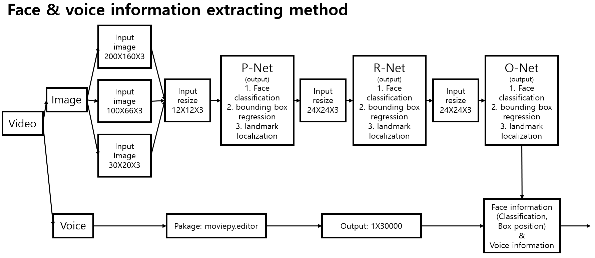
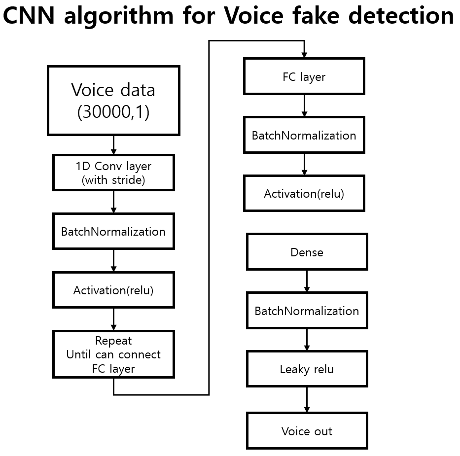

# mge51101-20196018

```
Name: YoungJun Choo  
Student No.: 20196018  
School: Business Analytics  
E-mail: gkdlfnddy@unist.ac.kr  

```

kaggle deepfake data 분석 

# mge51101-20196018

```
Name: YoungJun Choo  
Student No.: 20196018  
School: Business Analytics  
E-mail: gkdlfnddy@unist.ac.kr  

```

kaggle deepfake data 분석 

# Introduction
Nowadays, youtube generates many videos. someone makes fake videos and voices for their benefits. and it makes many problems in society. they make even president fake videos. Therefore, it is a very important technology. we research fake video detecting algorithm.

Recently, Deep Neural Networks is a paradigm. It solves many difficult problems such as NLP, S2S, Image Detection, Voice Recognition, MOT, GAN. In this paper, We use Two technology Image detection and Voice Recognition. Because it can relate to video analysis.

Many researchers publish noticeable papers about CNN. For example, MTCNN can detect faces, Batch normalization can allow using a high learning rate, Inception block can extract complicate feature. To apply the CNN algorithm for deepfake detection, we need to answer the following questions:

- Can we extract face from video without error?
- Can we get voice information from the video?
- Can we detect fake or not by using face and voice information?

Solving the above questions makes improvements about fake detection algorithm. In this paper, we don't have remarkable achievements. Because this paper is an intermediate process of algorithm development. Therefore, we focus on applying algorithms and experiment algorithms. The brief contributions can be summarized as follows:

- To extract the face image, we use the MTCNN algorithm and we consider error situations. so we can extract face from video without error.
- To extract voice information, we use moviepy package. It allows to extract voice information from the video.
- To detect fake or not, we use the CNN algorithm, inception block, Batch normalization, Sigmoid activation function for the last activation function.

Finally, we have a discussion about our experiment and future works.

# Related work

The literature on image detection and CNN algorithm is vast and span. So, we focus on recent research about Convolution Neural Networks. To detect the face,  some of the CNNs based face detection approaches have been proposed in recent years. Yang et al. [11] train deep convolution neural networks for facial attribute recognition to obtain a high response in face regions which further yield candidate windows of faces. However, due to its complex CNN structure, this approach is time costly in practice. Li et al. [19] use cascaded CNNs for face detection, but it requires bounding box calibration from face detection with the extra computational expense and ignores the inherent correlation between facial landmarks localization and bounding box regression. To overcome the previous problem MTCNN is suggested and it shows high performance we use this algorithm for face detection.

To detect fake, feature extraction algorithm is also important. Many researchers know it is important and publish many papers. Residual bock is proposed to alleviate gradient descent with low parameters. For the same reason, the Densely block is designed and it has an additional advantage about preservation images minor characteristics. Google develops inception block. this algorithm's advantages are dimension reduction and extraction of non-linear features. We apply this inception block. 

[11] S. Yang, P. Luo, C. C. Loy, and X. Tang, “From facial parts responses to
face detection: A deep learning approach,” in IEEE International Conference on Computer Vision, 2015, pp. 3676-3684.
[19] H. Li, Z. Lin, X. Shen, J. Brandt, and G. Hua, “A convolutional neural
network cascade for face detection,” in IEEE Conference on Computer
Vision and Pattern Recognition, 2015, pp. 5325-5334.
mtcnn: Zhang et al, Joint Face Detection and Alignment using Multi-task Cascaded Convolutional Networks, 2016

# Method

 In this section, we will have a comprehensive explanation of MTCNN, Face extraction algorithm, one image analysis algorithm, Voice analysis algorithm, last analysis algorithm and overall structure.

In the MTCNN Section, we refer to MTCNN and just apply it to our model for extracting face. This method consists of P-Net(Proposed Network), R-Net(Refinement Network), O-Net(Output Network). Each Network has its own functions. P-Net proposes candidates of windows about face classification by using input(12x12x3), bounding box regression, facial landmark location. The highly overlapped information is merged by NMS. After this information becomes R-Net input data(24x24x3). It is working similarly to P-Net, but R-Net analysis more detailly. R-Net’output data becomes O-Net’input data(48x48x3). O-Net analyzes a similar way and makes a more detailed output. This initial input image has a pyramid structure(200X160X3, 100X66X3, 30X20X3).



(Figure 1 MTCNN 3 key methods with pyramid input)

In the Face extraction algorithm Section, we make this algorithm to extract face image from video. MTCNN can extract face 95%, so we need to consider the error situations.


(Figure 2 Face extraction algorithm)


In the One Image fake detection Algorithm,


(Figure 3 one image analysis algorithm)


In the Voice fake detection Algorithm,



(Figure 4 Voice fake detection Algorithm)

In theLast CNN Algorithm,


(Figure 5 Last CNN Algorithm)


In the Overall structure,


(Figure 6 Overall structure)


# Result

# Conclution


